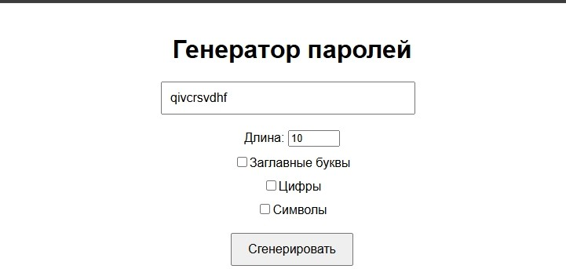
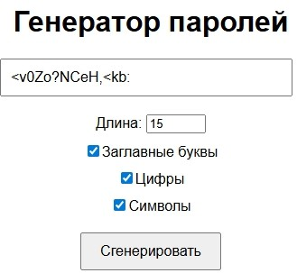
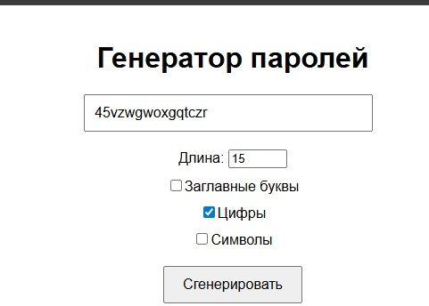

# Генератор паролей
Простое React-приложение для генерации случайных паролей с возможностью настройки параметров.
## Функции
- Настройка длины пароля (от 4 до 50 символов)
- Включение/отключение заглавных букв, цифр и специальных символов
- Генерация случайного пароля по нажатию кнопки
### Cкриншоты работы

